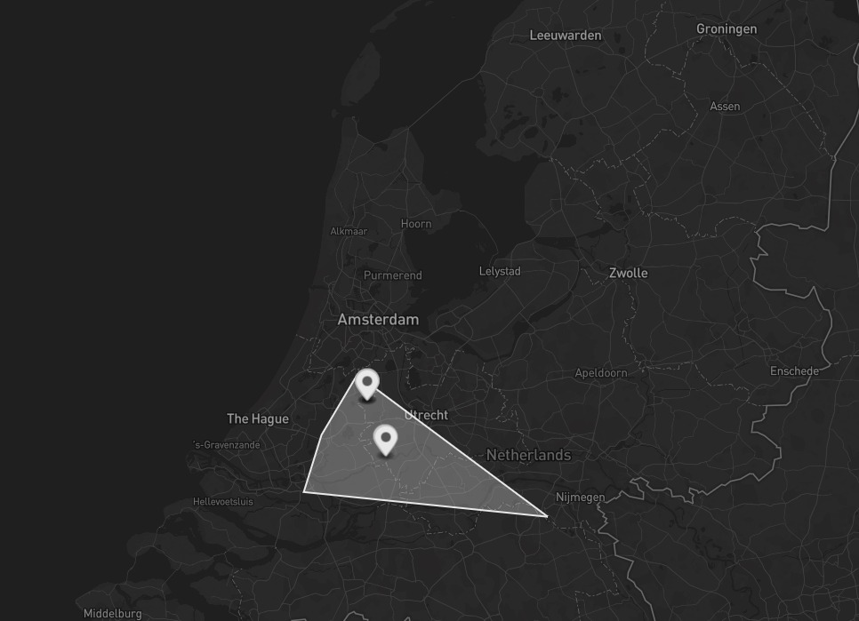
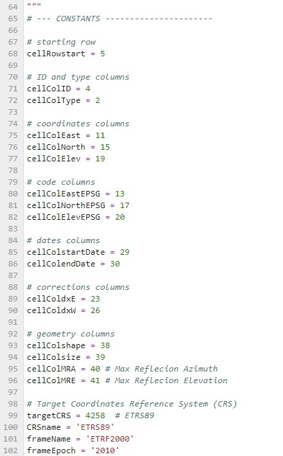

### Selection Algorithm
v1.0 - 18/08/2023

**Description**

The code is thought to be integrated in a bigger flow (e.g. Caroline), the I/O interface is as follows:

+ *Input* : a `selection.parms` file containing the run parameters

+ *Output* : 3 files containing informations about the selected targets inside an Area of Interest (AoI)
    + `reflectors.json` file, to ensure compatibility with GECORIS
    + `reflectors.csv` file, to ensure compatibility with GECORIS and readability of output
    + `SelectedTargetsMap.geojson` file, to visualize graphically the selected reflectors

At the moment, the radarcoding part is not yet ready, but will be available soon


**Installation**

From the terminal:


1. Make sure to have the required libraries installed python environent by running the following line in the environment you'd like to use:
```
pip install openpyxl matplotlib geopandas shapely

```

2. Download  `main.py` and `.parms` file from: https://github.com/Pbaz98/radarcoding-tool.git to the destination directory:

```
git clone https://github.com/Pbaz98/radarcoding-tool.git destination-directory-name
```


**Setting parameters**

An example of the `selection.parms` file is:
```
{
"project" : 'selectionTEST',
"aoiDir" : '/home/caroline-pbazzocchi/algorithm/testAoI/',
"targetDB" : '/home/caroline-pbazzocchi/algorithm/IGRSdata/Database_DesignatedTargets_TUDelft_v20230810.xlsx',
"outDir" : '/home/caroline-pbazzocchi/algorithm/SelectedTargets/',
"convFlag" : 1,                 # 0 = do not ... / 1 = save transformed coordinates in the target CRS in a csv file
"mapFlag" : 1,                  # 0 = do not ... / 1 = save geojson file in outDIr, copypaste to https://geojson.io to display it
"exclTarget" : []             # row indexes of the target to exclude (1 = first target in the Database)
}
```

+ "project": name of the project
+ "aoiDir": path/to/directory containing the shapefile(s) with the area of interest. You can draw an AoI and create the shapefile from geojson.io
+ "targetDB": path/to/database of the designated targets. 
  The up to date version of the TU Delft's Database of designated targets can be downloaded from: https://docs.google.com/spreadsheets/d/1_7z-NkgSXSUaAKjsdMYRlsOjZeyLqc-v/edit?usp=sharing&ouid=104604842686121190070&rtpof=true&sd=true

+ "outDir": path/to/outputDirectory, where the output files will be stored

+ "convFlag": if set to 1, a `.csv` file is generated, containing the coordinates of all the reflectors in the target CRS (by default ETRS89, equal to EPSG:4258). This is useful as the coordinates conversion takes some minutes, so in case we want to perform multiple runs with the same database, after the first run we can copy-paste the converted coordinates (and epsg code) into the corresponding column of our local copy of the database, saving tiume and resources in the following runs.

+ "exclTarget": this list is to be filled with the target's number that we want not to select.
  The target's number is defined as the number in the first column of the Database. For example target 1 is the target with ID_by_operator1= CBW (see database)


**Run the code and read output**

1. Go to the directory where the repository has been cloned:
```
cd path/to/destination-directory-name
```
   and run the script by:
   
```
python main.py selection.parms
```

2. To visualize graphically the result, open the `.geojson` file, and copy-past the content to the right box at https://geojson.io. a map with AoI and the selected targets will be displayed:

<figure>
  
</figure>


**Troubleshooting**

At the moment this README is written, not every target in the database has the epsg code specified. Please when you download the database for running the code, verify that every target has its corresponding epsg code. In case it's not, please use as temporary vesion the one contained in the example folder. That version was updated on 8/18/2023, and all the epsg codes are specified (but they need to be confirmed)
    
In case the database is modified, and some columns are added/removed, the Code might fail in locating the correct column to read. You can manually solve this issue by opening `main.py` and updating the numbers of the columns corresponding to each datum:
    
<figure>
  
</figure>
